[My github repo](https://github.com/kelly20011011/1121-web-409730347.git)

[Final Project](https://1121-web-409730347.vercel.app)

### Part 1: 個人化 portfolio (60%)

##### => 期末 project 要有 header, footer, 及 Hero, Resume, Gallery 三項資訊，基本上請放在同一個頁面上，如有特殊需求，可以放在不同的頁面上，但都要出現一樣的 header 及 footer

##### => 請說明 Hero, Resume, Gallery，是如何產出的? 如果有異於老師上課框架，個人有修改過的項目，請說明並附上圖片。任何有參考網路資源部分，請列出其來源。
內容使用網路範例進行修改:
[example](https://youtu.be/AKNvTxWOdKw)
##### => 如果用老師上課的架構 (html, css, js) 修改，將文字及圖片換成跟自己有關的資訊，有基本分 50%。修改的愈多，分數愈高，但需要詳細以文字及圖片做說明。

#### P1-1: Hero Page (個人主頁)
製作說明：提供上方選單。以及摺疊下拉式選單，點擊選單連結皆會跳轉到對應section，以左側為文字以及vercel、github連結做設計，右側擺放自己的照片，提供相應是顯示之畫面，當畫面小於576px顯示。
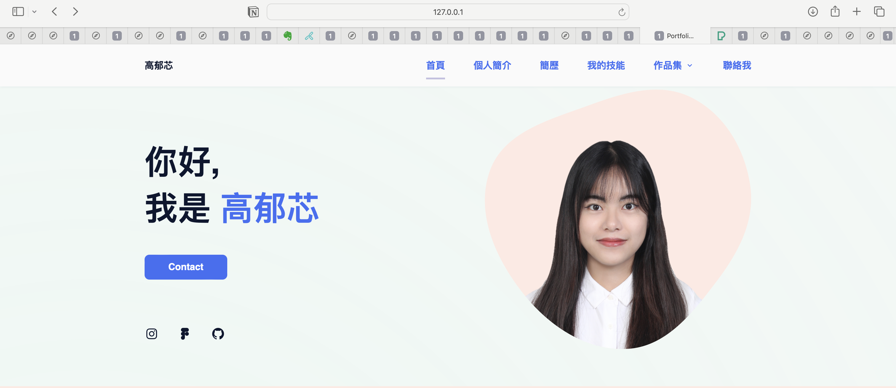
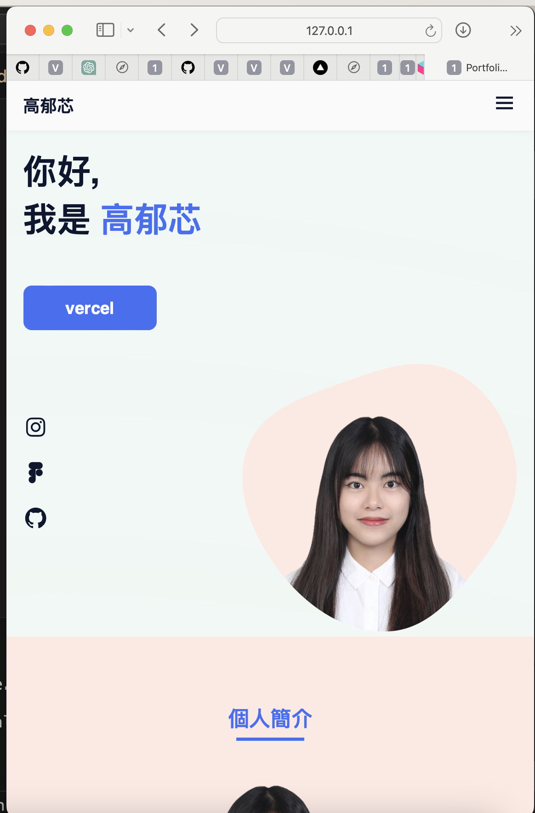
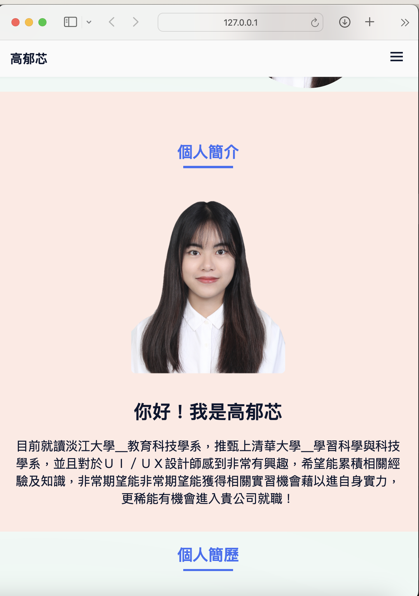
---

#### P1-2: Resume (履歷表)
製作說明：個人履歷，滑鼠觸碰顯示詳細資訊，提供動效顯示，替換原有的技能調成學習經歷並製作時間軸，觸碰顯示學習經歷的事蹟
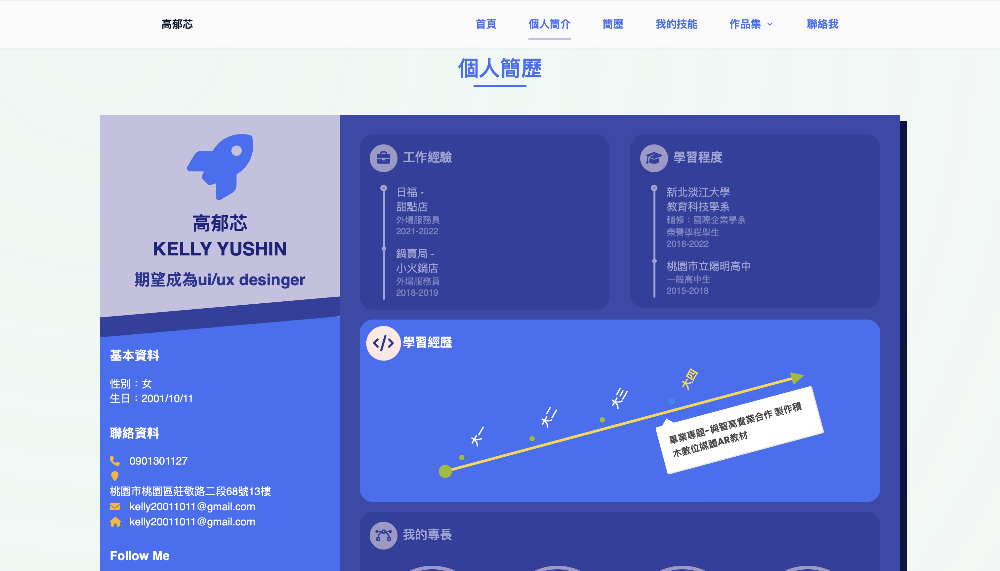
#### P1-2: 自行增加的skills(我的技能)
製作說明：根據自身能力製作技能條，顯示自身學習軟硬體能力
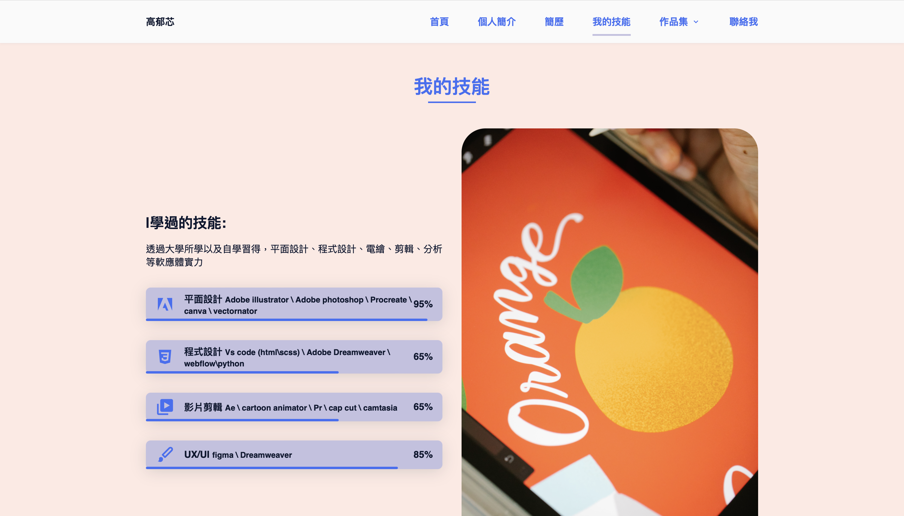

---

#### P1-3: Gallery (圖片集、作品集)
製作說明：

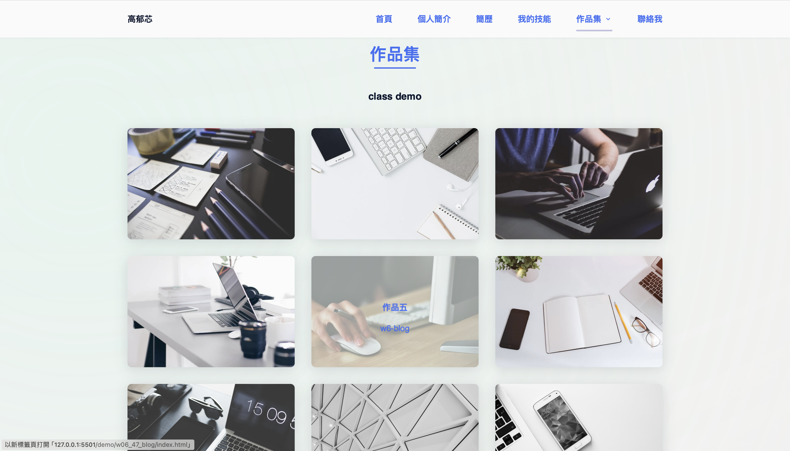
#### P1-4: 自行增加的contact(聯絡我)
製作說明：
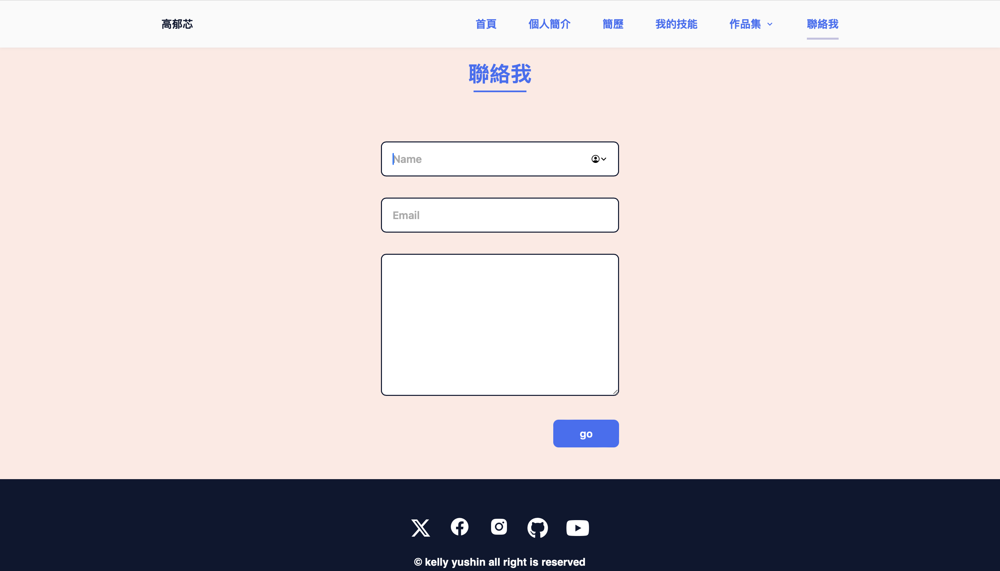
---

### Part 2: 響應式網頁 (20%)

##### => 斷點(breakpoint)，至少要有三個以上 (desktop, tablet, phone)，斷點 px 請根據你的設計自行決定

##### => 至少 3 個以上的 section，有些用 breakpoints，有些用 minmax ，要兩個都包含。

#### P2-1:
#### 製作說明：斷點一：992px 作品集一列顯示3張圖片，滑鼠觸碰圖片顯示作品名稱，圖片以放大及透明度做變化，點擊圖片可以跳轉到相對應的class-demo，與上方navbar功能對應
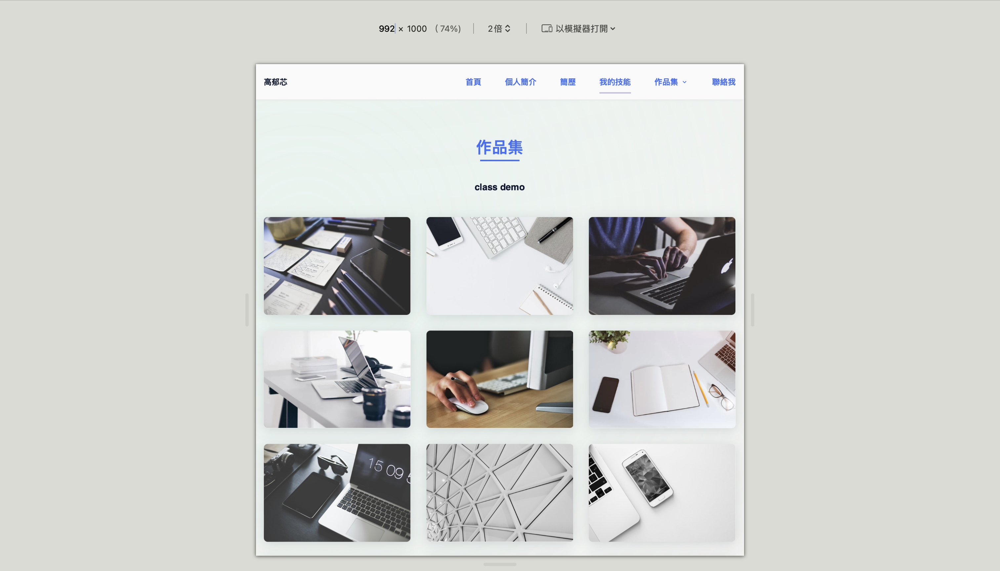

---

#### P2-2:
#### 製作說明：斷點二：768px 作品集一列顯示2張圖片，滑鼠觸碰圖片顯示作品名稱，圖片以放大及透明度做變化，點擊圖片可以跳轉到相對應的class-demo，與上方navbar功能對應
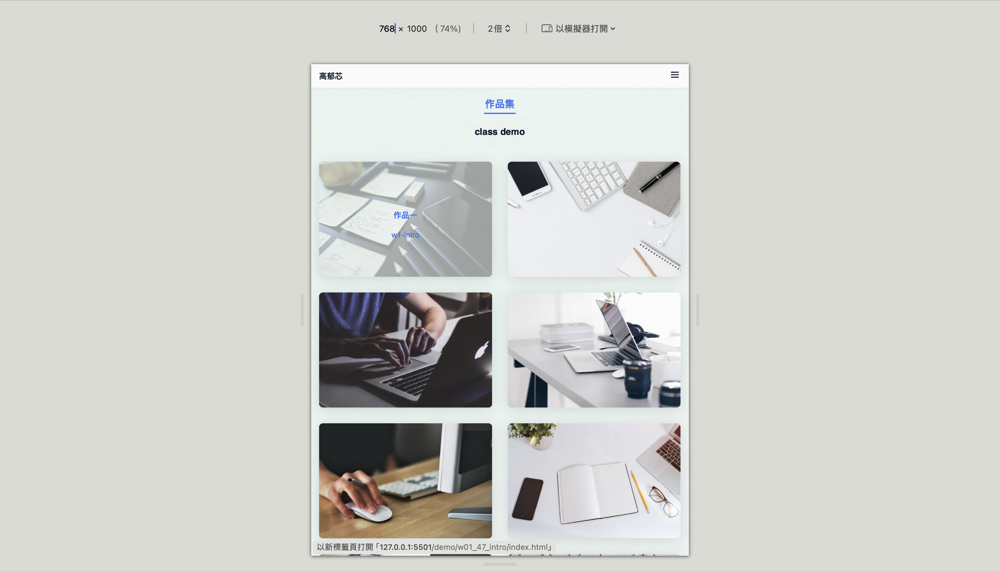

---

#### P2-3:
#### 製作說明：斷點三：576px 作品集一列顯示1張圖片，滑鼠觸碰圖片顯示作品名稱，圖片以放大及透明度做變化，點擊圖片可以跳轉到相對應的class-demo，與上方navbar功能對應
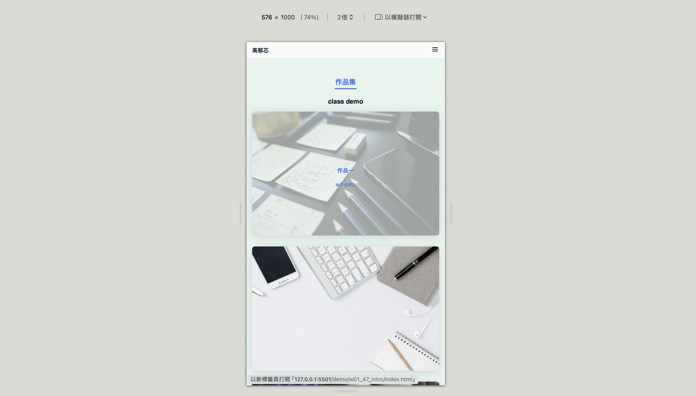

#### 製作說明：斷點共四個：320px/576px/768px/992px css代碼
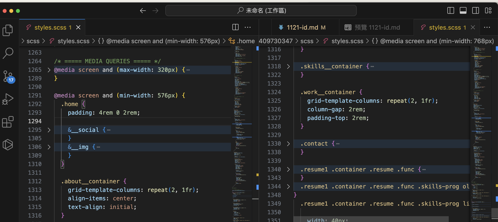
#### 製作說明：當使用手機觀看時，螢幕在小於768之下，320以上時選單會折疊顯示下拉選單
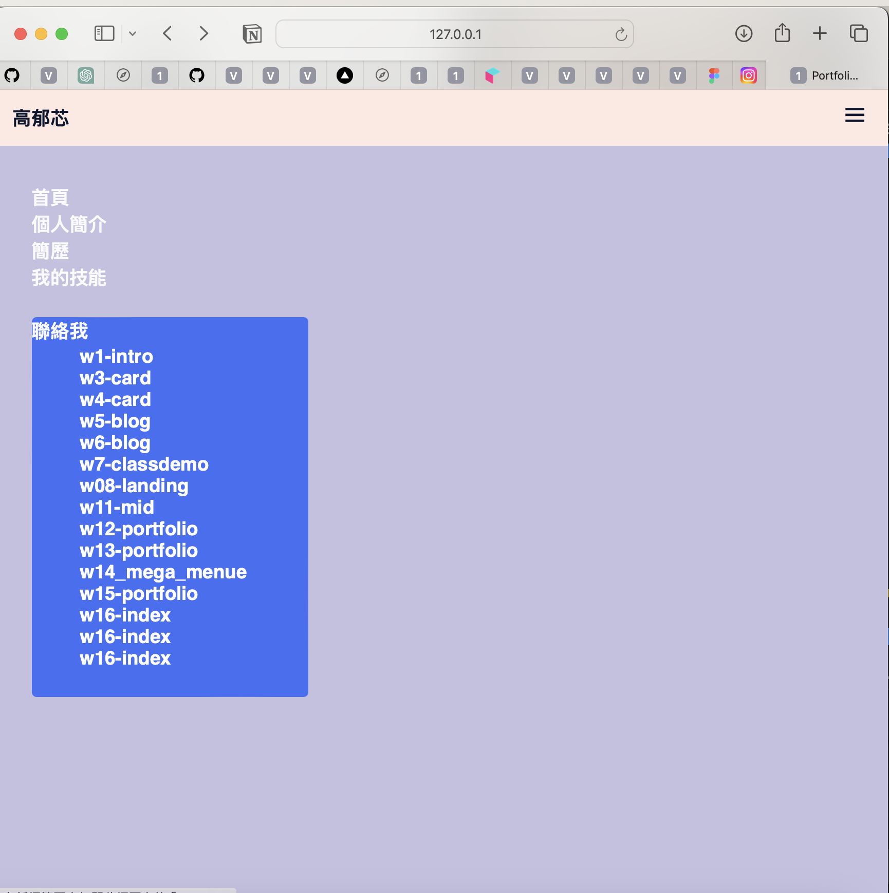

---

### Part 3: 上課 class demo (20%)

##### => 請說明是否上課每個 demo，包含期中考，都有建立連結並可以正確執行
#### 製作說明：滑鼠觸碰期末作品集中的圖片，會顯示作品名稱，圖片以放大及透明度做變化，點擊圖片可以跳轉到相對應的class-demo，與上方navbar功能對應，而且每一個class-demo皆有建立相對應的navbar可以跳轉回期末作品

[My Class Demo Repo](https://1121-web-409730347.vercel.app/demo/megamenu.html)
