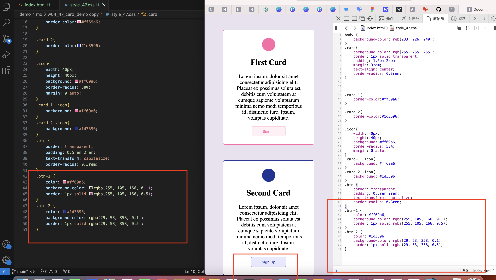

[My github repo](https://github.com/kelly20011011/1121-web-409730347.git)

### w04-p1:Card Demo with .btn,.btn-1,.btn-2 class



```
d991d84 高郁芯  Wed Oct 4 14:28:01 2023 +0800    w04-p1:Card Demo with .btn,.btn-1,.btn-2 class
```

### w04-p2: show w04-p1 from vercel with url
[w04-p2 vercel url](https://1121-web-409730347.vercel.app/demo/md/w04_47_card_demo/)


```
8753640 高郁芯  Wed Oct 4 14:58:18 2023 +0800   w04-p2: show w04-p1 from vercel with url
```


### w04-p3 :show cards with two photos in vercel
[w04-p3 vercel url](https://1121-web-409730347.vercel.app/demo/md/w04_47_card_demo/)

```

885393e 高郁芯  Wed Oct 4 15:40:52 2023 +0800   w04-p3 :show cards with two photos in vercel
```
### w04-p4 :w4 git logs

```
git log --pretty=format:"%h%x09%an%x09%ad%x09%s" --after="2023-09-26"
83f2c57 高郁芯  Wed Oct 4 15:44:23 2023 +0800   w04-p4 :w4 git logs
885393e 高郁芯  Wed Oct 4 15:40:52 2023 +0800   w04-p3 :show cards with two photos in vercel
1609c05 高郁芯  Wed Oct 4 15:35:59 2023 +0800   w04-p4 :w4 git logs
8b41272 高郁芯  Wed Oct 4 15:33:46 2023 +0800   w04-p4 :w4 git logs
8753640 高郁芯  Wed Oct 4 14:58:18 2023 +0800   w04-p2: show w04-p1 from vercel with url
6295cd8 高郁芯  Wed Oct 4 14:33:31 2023 +0800   w04-p2: show w04-p1 from vercel with url
d991d84 高郁芯  Wed Oct 4 14:28:01 2023 +0800    w04-p1:Card Demo with .btn,.btn-1,.btn-2 class
6a1e702 高郁芯  Wed Oct 4 14:19:25 2023 +0800    w04-p1:Card Demo with .btn,.btn-1,.btn-2 class
2747ce0 高郁芯  Wed Oct 4 14:00:13 2023 +0800   w04-p1:Card Demo with .btn,.btn-1,.btn-2 class
5a025e3 高郁芯  Wed Oct 4 13:53:02 2023 +0800   w04-p1:Card Demo with .btn,.btn-1,.btn-2 class
73afffb 高郁芯  Wed Oct 4 13:48:54 2023 +0800   w04-p1:Card Demo with .btn,.btn-1,.btn-2 class
145b862 高郁芯  Wed Sep 27 16:04:09 2023 +0800  w03-p2: Card Demo using .icon, .card-1 .card-1 css
6e2e652 高郁芯  Wed Sep 27 15:44:27 2023 +0800  w03-p2: Card Demo using .icon, .card-1 .card-1 css
95e2ad9 kelly   Wed Sep 27 15:03:49 2023 +0800  w03-p1:Card Demo with .card css

```