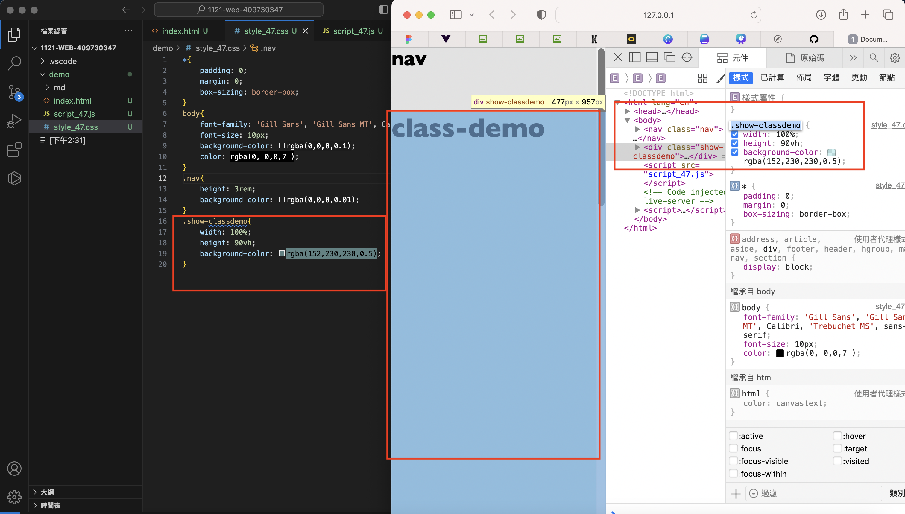

[My github repo](https://github.com/kelly20011011/1121-web-409730347.git)

### w07-p1:create nav and classdemo with css



```

```

### w05-p2: show 3 photos in a row,containing all css in a blog article
```

```


### w05 git logs
