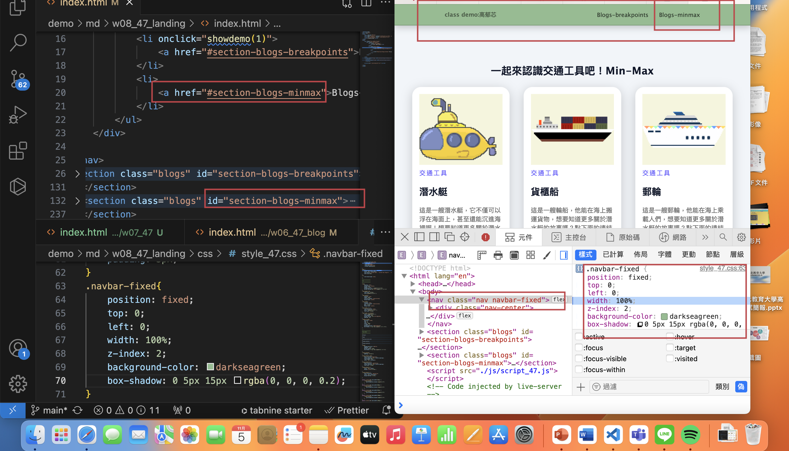

[My github repo](https://github.com/kelly20011011/1121-web-409730347.git)

### w08-p1:show the section of #section-blogs-minmax with navbar-fixed css



```
20c3315 kellyyushin     Sun Nov 5 13:50:51 2023 +0800   ### w08-p1:show the section of #section-blogs-minmax with navbar-fixed css
```

### w08-p2: use javascript to create a fixed navbar when mouse move dowm to some extent,remove when original nav appears
```
4d2ca05 kellyyushin     Sun Nov 5 14:13:16 2023 +0800   ### w08-p2: use javascript to create a fixed navbar when mouse move dowm to some extent,remove when original nav appears
```


### w08-p3 : create index.html of my landing page


```
4863216 kellyyushin     Wed Oct 25 15:14:42 2023 +0800  ### w07-p3 : show classdemo w1,w6,w7
```
### w07-p4 : w7 git logs

```
pc133:1121-web-409730347 gaoyuxin$ git log --pretty=format:"%h%x09%an%x09%ad%x09%s" --after="2023-09-26"
58e3176 kellyyushin     Wed Oct 25 15:17:02 2023 +0800  ### w07-p4 : w7 git logs
4863216 kellyyushin     Wed Oct 25 15:14:42 2023 +0800  ### w07-p3 : show classdemo w1,w6,w7
51bb30f kellyyushin     Wed Oct 25 14:18:57 2023 +0800  ### w07-p2: create nav links of class demo
620206e kellyyushin     Wed Oct 25 13:52:15 2023 +0800  ### w07-p1:create nav and classdemo with css
5a66510 kellyyushin     Wed Oct 25 13:48:24 2023 +0800   w07-p1:create nav and classdemo with css
```