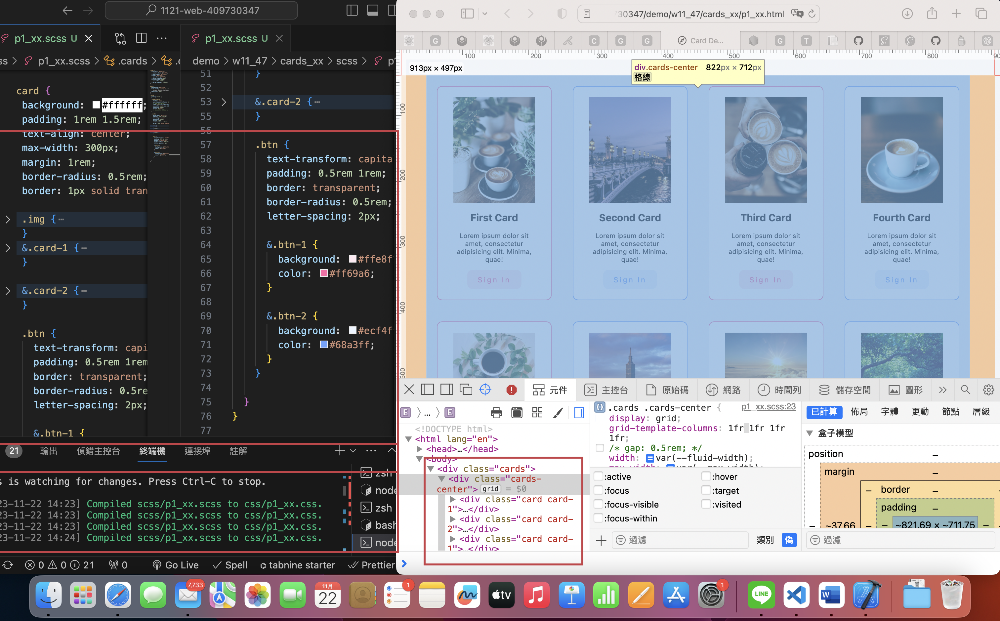
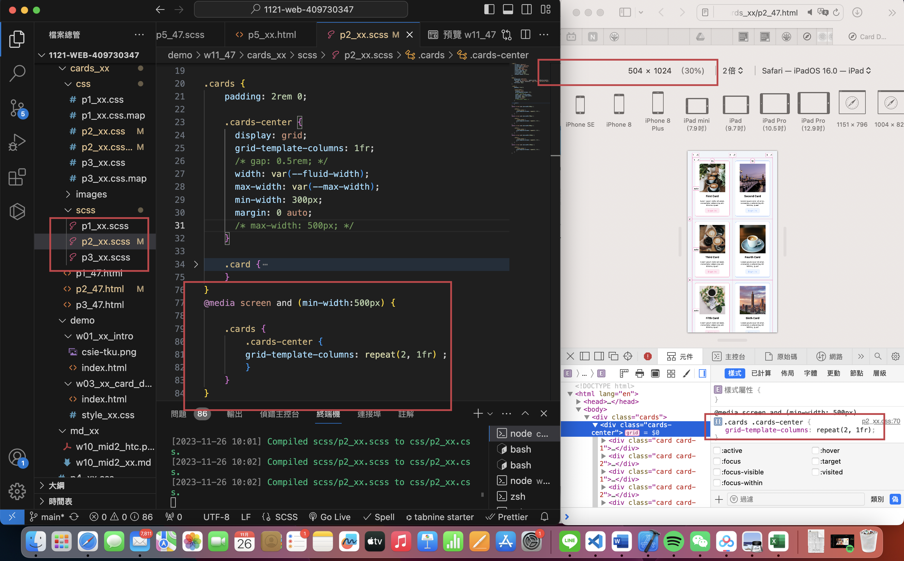

 ### W11-P1: Use scss to finish p1_47
 

 
```
ff9d5af kellyyushin     Wed Nov 22 14:37:20 2023 +0800   ### W11-P1: Use scss to finish p1_47
```
 ### W11-P2: convert css of w1-intro and w3-card into scss, and insert them into p5_47.scss 
 

 
```
ff9d5af kellyyushin     Wed Nov 22 14:37:20 2023 +0800   ### W11-P1: Use scss to finish p1_47
```
 ### W11-P3: w11 git logs
 

 
```
ff9d5af kellyyushin     Wed Nov 22 14:37:20 2023 +0800   ### W11-P1: Use scss to finish p1_47
```