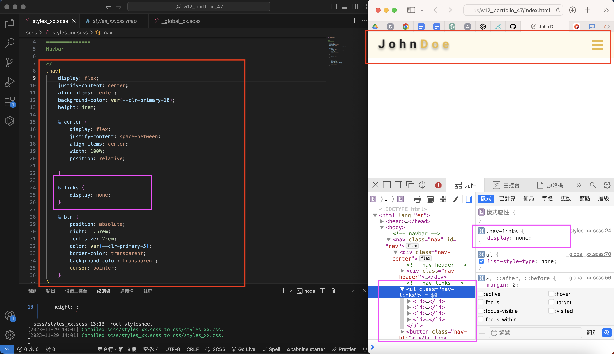

[My github repo](https://github.com/kelly20011011/1121-web-409730347.git)

 ### W12-P1: create menu bar with nav links missing
 

 
```
4efc7f1 kellyyushin     Wed Nov 29 14:09:41 2023 +0800   ### W12-P1: create menu bar with nav links missing
```
 ### W11-P2: convert css of w1-intro and w3-card into scss, and insert them into p5_47.scss 
 

 
```
c0e56f6 kellyyushin     Sun Nov 26 09:33:59 2023 +0800   ### W11-P2: convert css of w1-intro and w3-card into scss, and insert them into p5_47.scss
```
 ### W11-P3: do p2_47.scss responsive for p2_47
 

 
```
6f9fd27 kellyyushin     Sun Nov 26 10:08:09 2023 +0800   ### W11-P3: do p2_47.scss responsive for p2_47
```
 ### W11-P4: w11 git logs
 

 
```
gaoyuxin@gaoyuxindeMacBook-Pro 1121-web-409730347 % git log --pretty=format:"%h%x09%an%x09%ad%x09%s" --after="2023-09-26"
7fbed65 kellyyushin     Sun Nov 26 10:10:10 2023 +0800  ### W11-P4: w11 git logs
6f9fd27 kellyyushin     Sun Nov 26 10:08:09 2023 +0800   ### W11-P3: do p2_47.scss responsive for p2_47
c2e77ce kellyyushin     Sun Nov 26 09:38:19 2023 +0800   ### W11-P3: w11 git logs
c0e56f6 kellyyushin     Sun Nov 26 09:33:59 2023 +0800   ### W11-P2: convert css of w1-intro and w3-card into scss, and insert them into p5_47.scss
ff9d5af kellyyushin     Wed Nov 22 14:37:20 2023 +0800   ### W11-P1: Use scss to finish p1_47
```