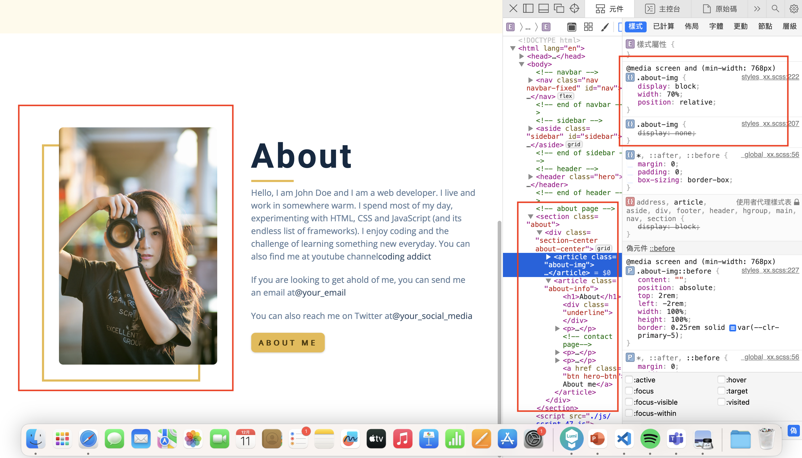

[My github repo](https://github.com/kelly20011011/1121-web-409730347.git)

 ### W13-P1: Show social icons of your own (five icons)
 

 
```
302b6bd kellyyushin     Mon Dec 11 20:08:30 2023 +0800   ### W13-P1: Show social icons of your own (five icons)

```
 ### W13-P2: Show hero section with photo displayed

 
```
5c5e4a0 kellyyushin     Mon Dec 11 21:08:40 2023 +0800   ### W13-P2: Show hero section with photo displayed
```
 ### W13-P3: Show About Section and its css
 


#### => show css 

 
```
baf7d9c kellyyushin     Mon Dec 11 21:42:00 2023 +0800   ### W13-P3: Show About Section and its css
```
 ### W13-P4: w11 git logs
 

 
```
gaoyuxin@gaoyuxindeMacBook-Pro 1121-web-409730347 % git log --pretty=format:"%h%x09%an%x09%ad%x09%s" --after="2023-09-26"
fb489f8 kellyyushin     Wed Nov 29 15:09:33 2023 +0800   ### W12-P4: w11 git logs
545271f kellyyushin     Wed Nov 29 15:04:27 2023 +0800   ### W11-P4: w11 git logs
686a375 kellyyushin     Wed Nov 29 15:03:34 2023 +0800   ### W12-P3: Create sidebar with close-btn
3e575f9 kellyyushin     Wed Nov 29 14:41:43 2023 +0800   ### W12-P2: Show nav-links when the screen is greater than 768px
0b1a319 kellyyushin     Wed Nov 29 14:10:55 2023 +0800   ### W12-P1: create menu bar with nav links:
```