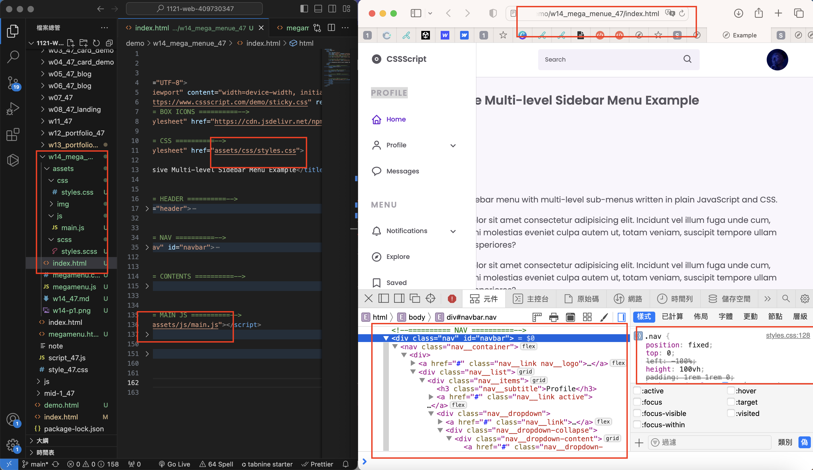
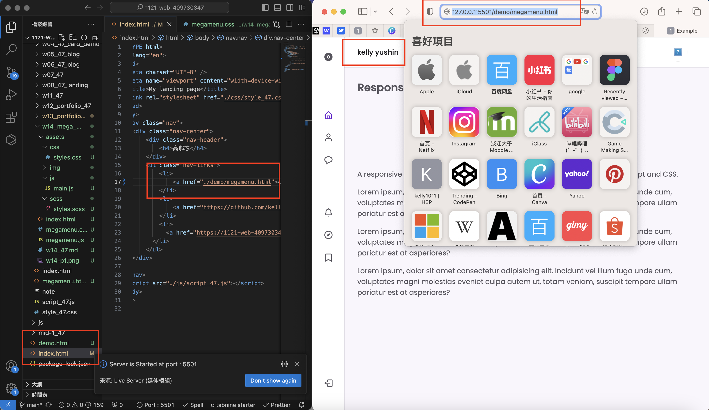
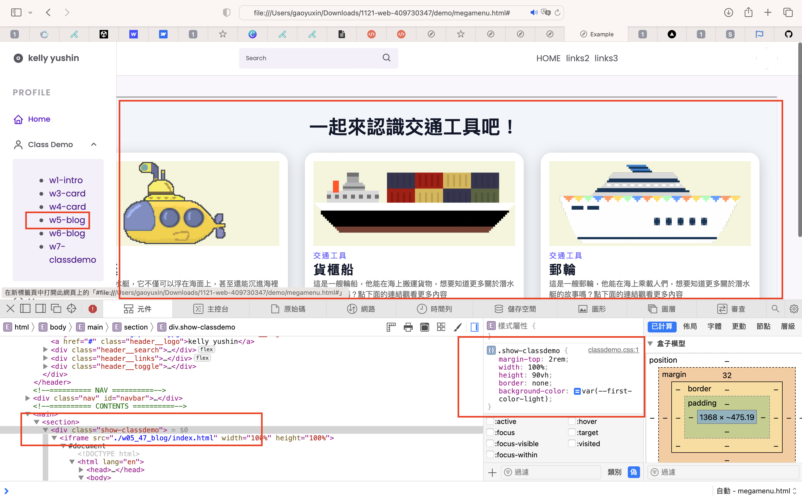
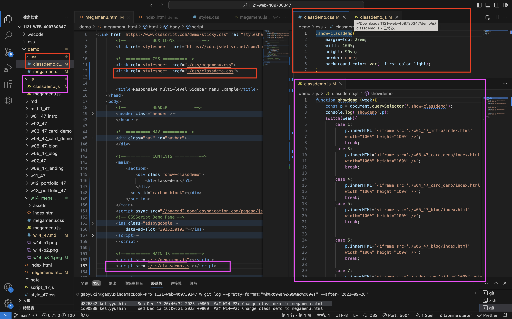
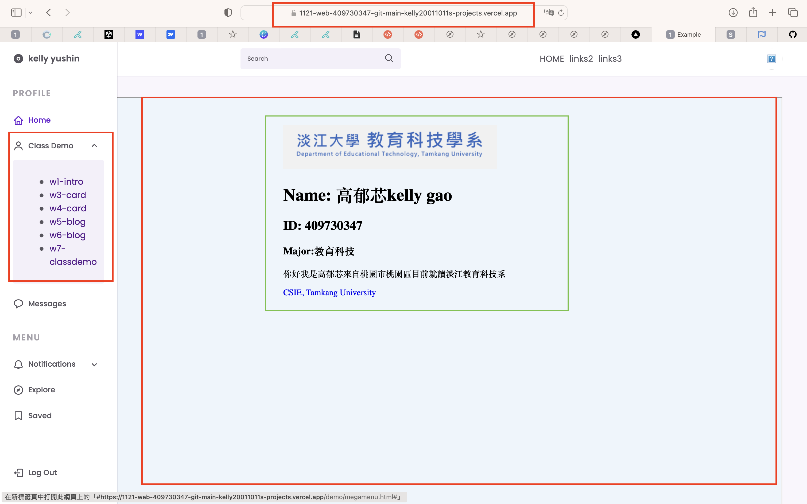
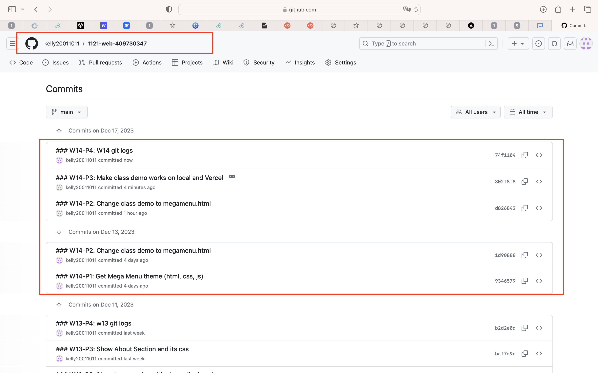

[My github repo](https://github.com/kelly20011011/1121-web-409730347.git)

 ### W14-P1: Get Mega Menu theme (html, css, js)

 
```
9346579 kellyyushin     Wed Dec 13 15:58:54 2023 +0800   ### W14-P1: Get Mega Menu theme (html, css, js)

```
### W14-P2: Change class demo to megamenu.html

 
```
d826842 kellyyushin     Sun Dec 17 20:40:32 2023 +0800  ### W14-P2: Change class demo to megamenu.html
```
### W14-P3: Make class demo works on local and Vercel 
##### => local
 

 

 
##### => Vercel
 

 
```
302f8f8 kellyyushin     Sun Dec 17 21:35:52 2023 +0800  ### W14-P3: Make class demo works on local and Vercel  ##### => local
```
### W14-P4: W14 git logs
 

 
```
gaoyuxin@gaoyuxindeMacBook-Pro 1121-web-409730347 % git log --pretty=format:"%h%x09%an%x09%ad%x09%s" --after="2023-09-26"

b2d2e0d kellyyushin     Mon Dec 11 21:47:04 2023 +0800   ### W13-P4: w13 git logs
baf7d9c kellyyushin     Mon Dec 11 21:42:00 2023 +0800   ### W13-P3: Show About Section and its css
5c5e4a0 kellyyushin     Mon Dec 11 21:08:40 2023 +0800   ### W13-P2: Show hero section with photo displayed
302b6bd kellyyushin     Mon Dec 11 20:08:30 2023 +0800   ### W13-P1: Show social icons of your own (five icons)

```