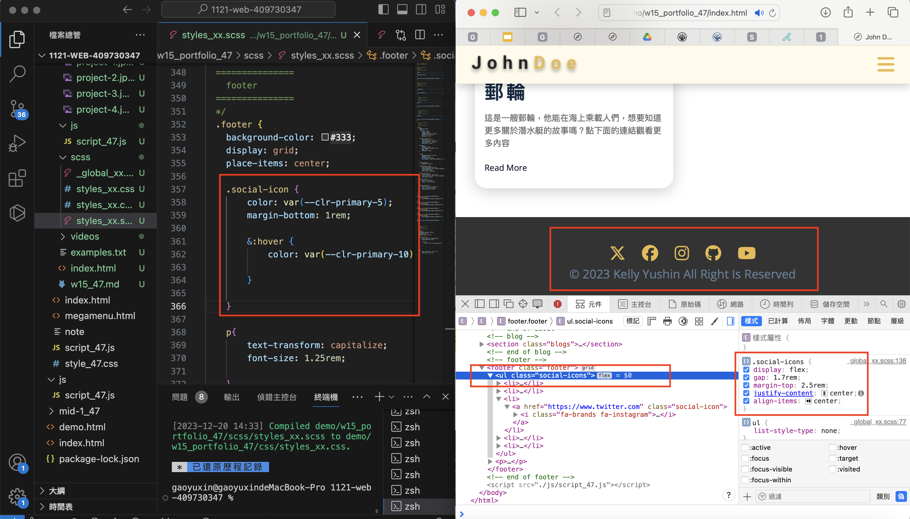
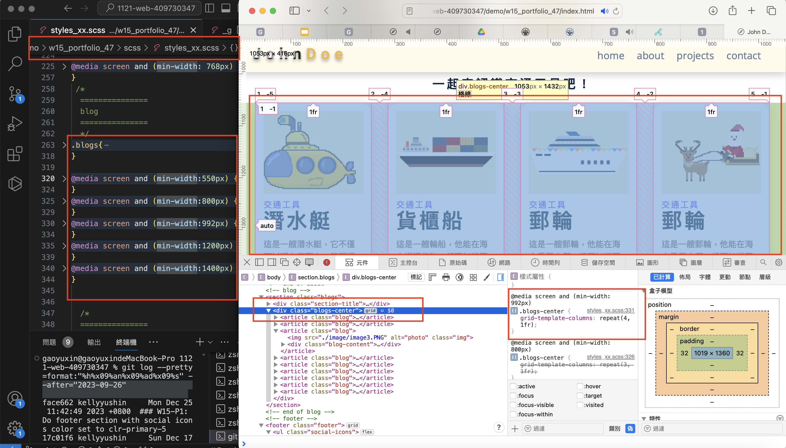
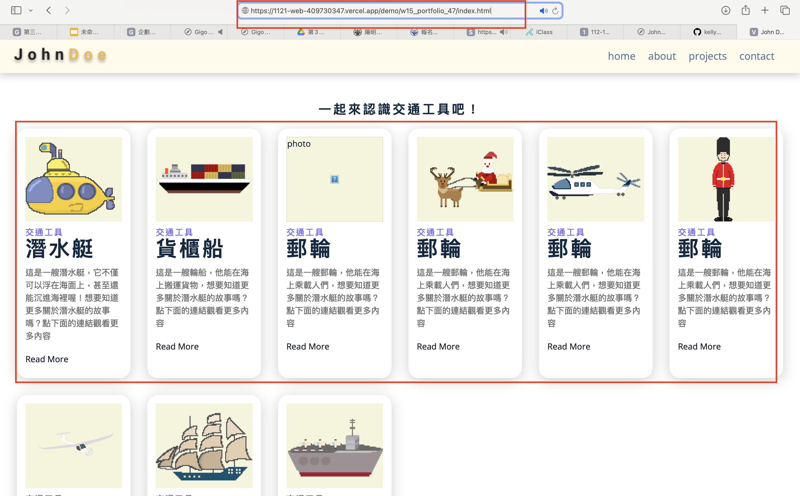
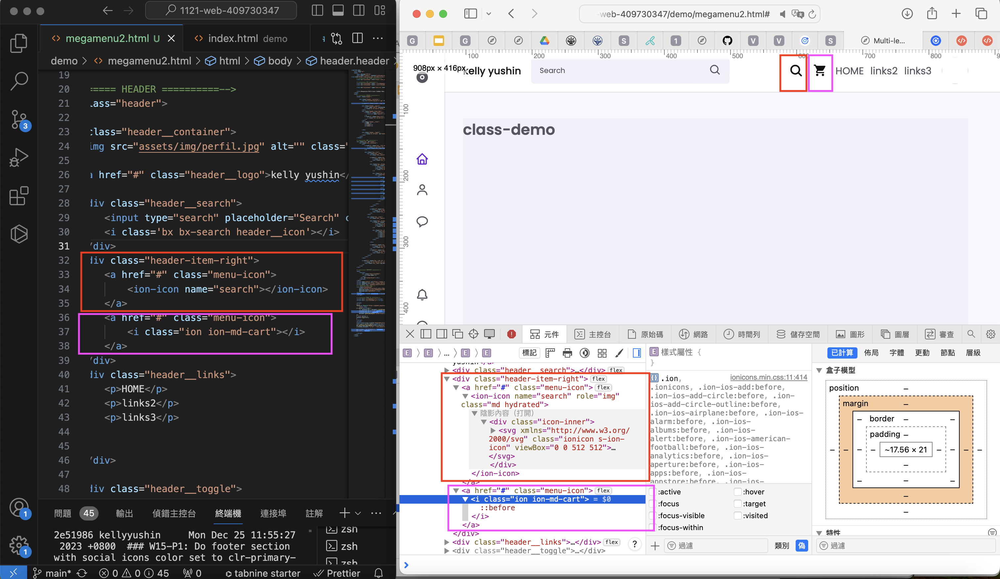
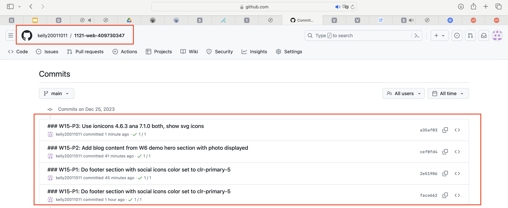

[My github repo](https://github.com/kelly20011011/1121-web-409730347.git)

### W15-P1: Do footer section with social icons color set to clr-primary-5
 
 

 
```
face662 kellyyushin     Mon Dec 25 11:42:49 2023 +0800  ### W15-P1: Do footer section with social icons color set to clr-primary-5

```
 ### W15-P2: Add blog content from W6 demo hero section with photo displayed
 
#### => local
 

 
#### => Vercel
 

 
```
cef0fd4 kellyyushin     Mon Dec 25 11:59:52 2023 +0800   ### W15-P2: Add blog content from W6 demo hero section with photo displayed
```
 ### W15-P3: Use ionicons 4.6.3 ana 7.1.0 both, show svg icons
 



 
```
a35af03 kellyyushin     Mon Dec 25 12:40:00 2023 +0800   ### W15-P3: Use ionicons 4.6.3 ana 7.1.0 both, show svg icons
```
### W15-P4: git logs of Week 15
 

```
gaoyuxin@gaoyuxindeMacBook-Pro 1121-web-409730347 % git log --pretty=format:"%h%x09%an%x09%ad%x09%s" --after="2023-09-26"

323b97c kellyyushin     Mon Dec 25 12:43:15 2023 +0800  ### W15-P4: git logs of Week 15
a35af03 kellyyushin     Mon Dec 25 12:40:00 2023 +0800   ### W15-P3: Use ionicons 4.6.3 ana 7.1.0 both, show svg icons
cef0fd4 kellyyushin     Mon Dec 25 11:59:52 2023 +0800   ### W15-P2: Add blog content from W6 demo hero section with photo displayed
2e51986 kellyyushin     Mon Dec 25 11:55:27 2023 +0800  ### W15-P1: Do footer section with social icons color set to clr-primary-5
face662 kellyyushin     Mon Dec 25 11:42:49 2023 +0800  ### W15-P1: Do footer section with social icons color set to clr-primary-5

```