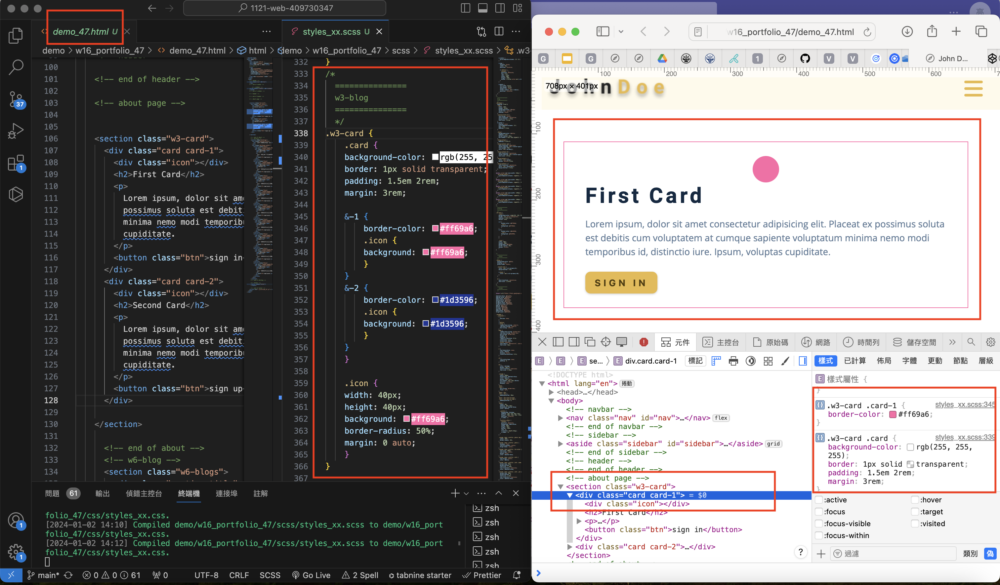
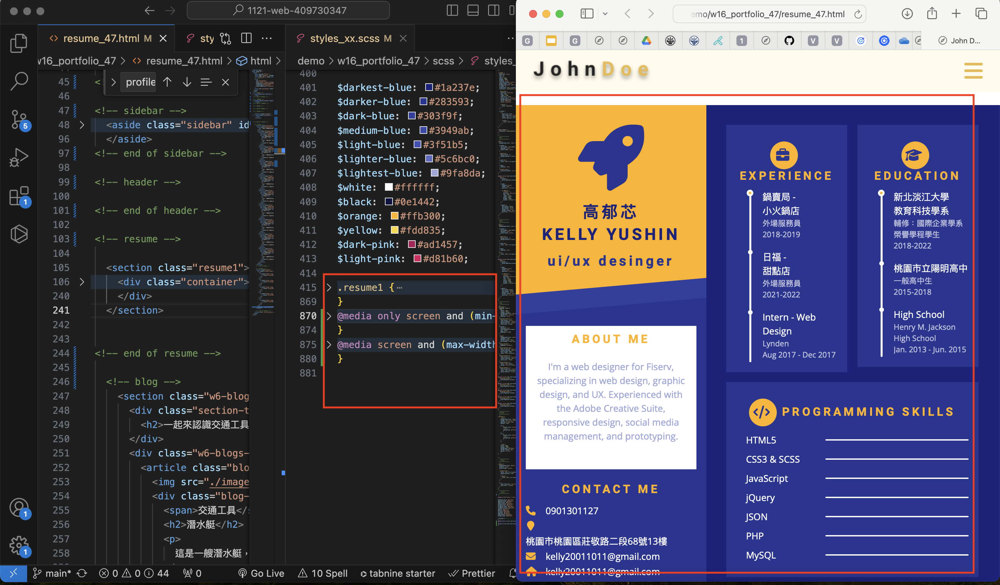
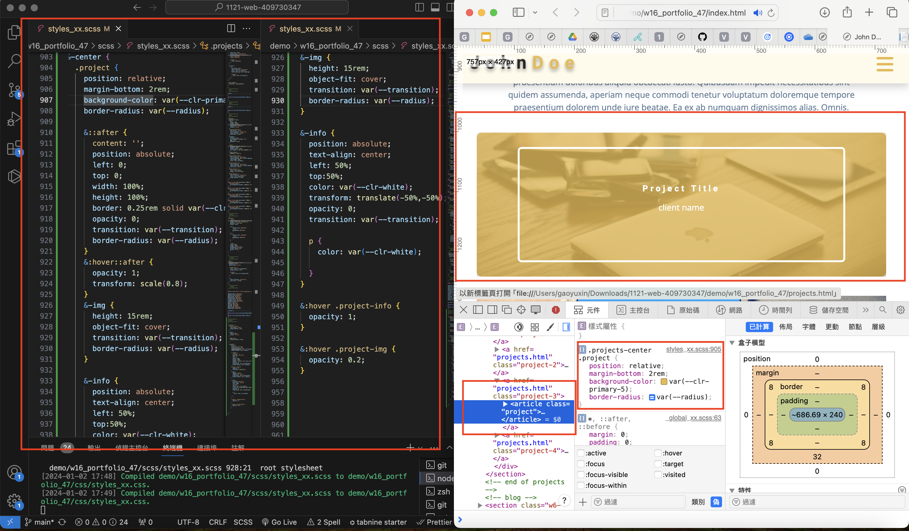
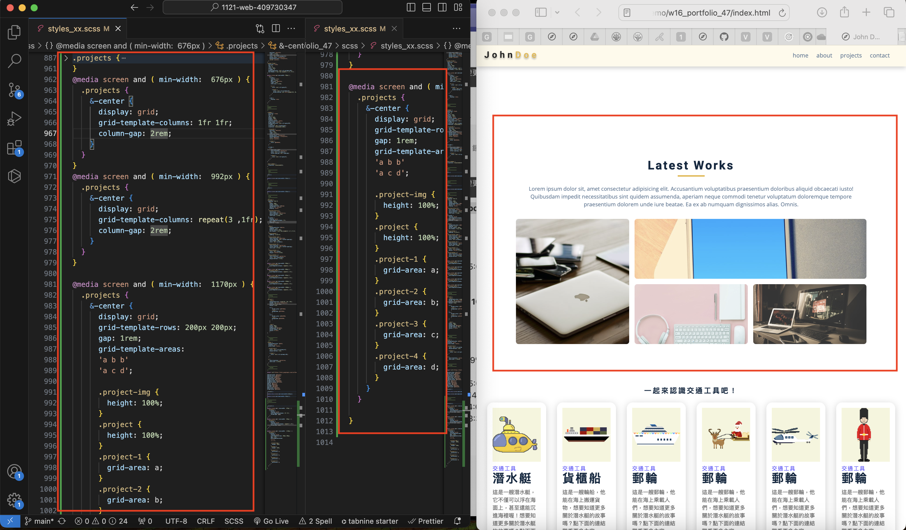
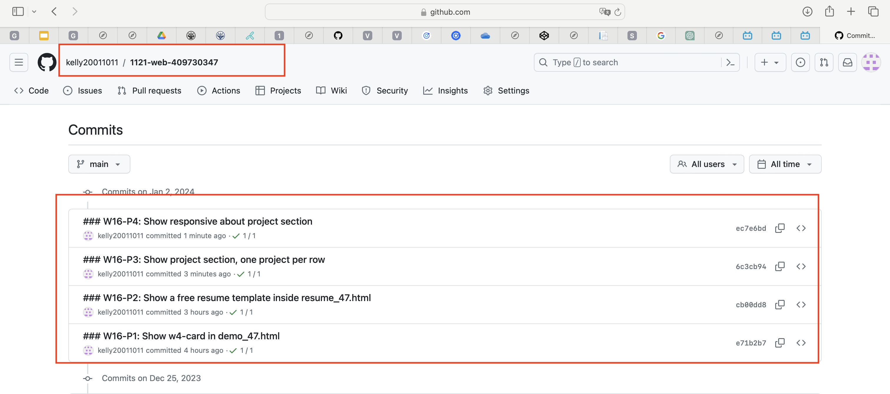

[My github repo](https://github.com/kelly20011011/1121-web-409730347.git)

### W16-P1: Show w4-card in demo_47.html
 

 
```
e71b2b7 kellyyushin     Tue Jan 2 14:18:11 2024 +0800   ### W16-P1: Show w4-card in demo_47.html
```
### W16-P2: Show a free resume template inside resume_47.html
 

 
 
```

cb00dd8 kellyyushin     Tue Jan 2 15:25:34 2024 +0800   ### W16-P2: Show a free resume template inside resume_47.html

```
### W16-P3: Show project section, one project per row
 



 
```
6c3cb94 kellyyushin     Tue Jan 2 18:19:29 2024 +0800   ### W16-P3: Show project section, one project per row
```
### W16-P4: Show responsive about project section
 

```
ec7e6bd kellyyushin     Tue Jan 2 18:21:13 2024 +0800   ### W16-P4: Show responsive about project section
```

 
### W16-P5: git logs of Week 16
 

```
gaoyuxin@gaoyuxindeMacBook-Pro 1121-web-409730347 % git log --pretty=format:"%h%x09%an%x09%ad%x09%s"
dc17272 kellyyushin     Tue Jan 2 18:25:52 2024 +0800   ### W16-P5: git logs of Week 16
ec7e6bd kellyyushin     Tue Jan 2 18:21:13 2024 +0800   ### W16-P4: Show responsive about project section
6c3cb94 kellyyushin     Tue Jan 2 18:19:29 2024 +0800   ### W16-P3: Show project section, one project per row
cb00dd8 kellyyushin     Tue Jan 2 15:25:34 2024 +0800   ### W16-P2: Show a free resume template inside resume_47.html
e71b2b7 kellyyushin     Tue Jan 2 14:18:11 2024 +0800   ### W16-P1: Show w4-card in demo_47.html

```